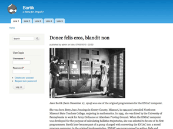

## Bartik

`base theme: classy`

*Bartik* was introduced in Drupal 7 as a new, clean and simple theme. The theme has some new cool features in Drupal 8 and is also completely responsive.

### Moving Bartik forward

During the development of Drupal 8, the Bartik theme was bairly making progress. For this reason, the maintainership for the theme has changed. Emma Maria is the new maintainer. This happend after the first couple of beta's. Since then Bartik really started to move forward again. 

- new maintainer: Emma
- interview with Emma

***

**Read more**

* [Bartik documentation on d.o](https://www.drupal.org/documentation/themes/bartik)
