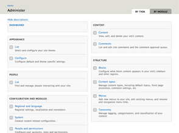

## Seven

`base theme: classy`

*Seven* was introduced in Drupal 7 as the default administrative theme. It was designed and created to improve the Drupal 7 user experience as part of the Drupal 7 UX initiative. Seven maintains to be the default administrative theme in Drupal 8. [A style guide for Seven](https://groups.drupal.org/node/283223) was introduced to improve this experience even more and give it a refreshing look. The Seven theme is currently maintained by [Lewis Nyman](https://www.drupal.org/u/lewisnyman).

> Some people might be wondering if this theme should be renamed to `eight` ([Rename Seven in D8](https://www.drupal.org/node/1297428))? The answer is **no**.

### An interview with Lewis Nyman

https://github.com/sqndr/d8-theming-guide/issues/17

***

**Read more**
