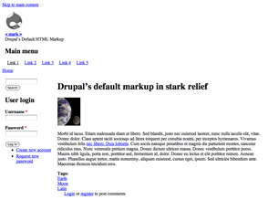

## Stark

*Stark* is a core theme that demonstrates Drupal's default markup. It does not contain any template files. This means it uses the template and css files from the (core) modules.

*Stark* can be very useful for **developers** to determine whether module-related CSS and JavaScript are interfering with a more complex theme. It can also be useful for **designers** interested in studying Drupal’s default markup without the interference of changes commonly made by more complex themes.

To avoid obscuring CSS added to the page by Drupal or a contrib module, the Stark theme itself has no styling, except just enough CSS to arrange the page in a traditional "header, sidebars, content, and footer" layout. Thanks to the Drupal 8 Mobile Initiative, [Stark uses a responsive layout in Drupal 8](https://www.drupal.org/node/1322794). The css rules for this responsive layout can be found in `css/layout.css`.

***

**Read more**
