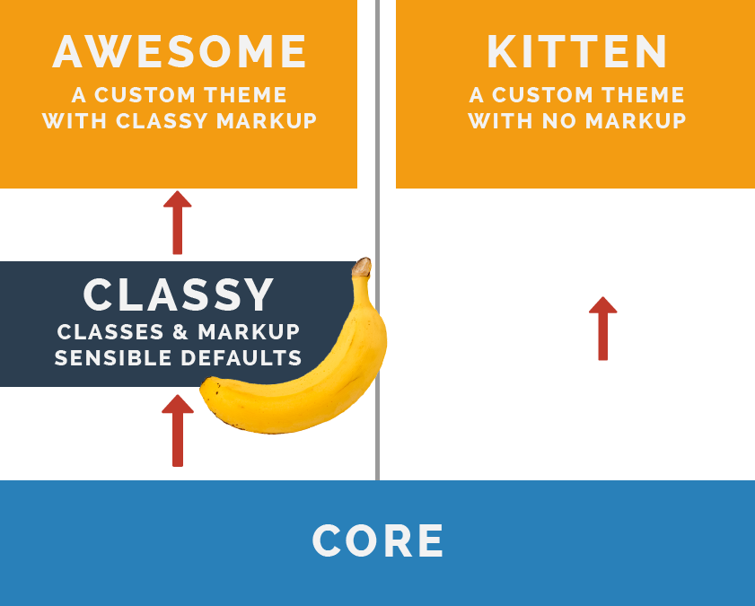

# Creating a custom theme

When creating a custom theme, there are three possibilities:

1. Use **Classy** as a base theme. This will result in some default classes and markup in your template files (since the template files from **Classy** will be used). You can however still override these template files in the custom theme.

2. Using **Stable** as a base theme. The minimum amount of default markup and classes will be added to the template files. This way, you have full control of all the markup and classes. **This is the default option!**

3. **Not using a base theme**, by setting `base theme: false`.

In the following example, the relationship between two custom themes and Classy is demonstrated. The first theme, *Awesome*, uses **Classy** as a base theme. The second theme, *Kitten*, doesn't use **Classy** as a base theme.

