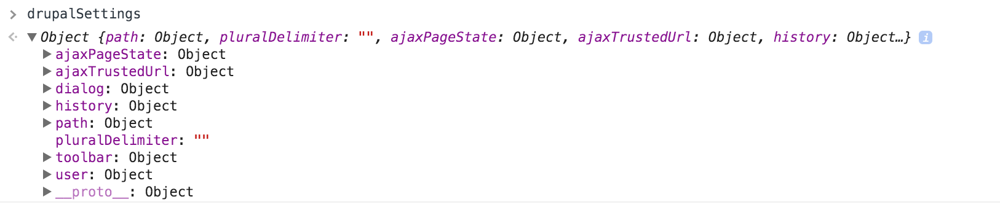

## The drupalSettings namespace

To pass settings from PHP to Javascript, the `drupalSettings` namespace is used. These settings are printed before any other javascript on the page.

----

**Read more**

* [JavaScript settings moved from Drupal.settings to global drupalSettings variable](https://www.drupal.org/node/1793334)
