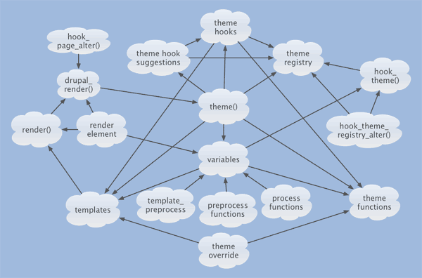

# The new theme layer

Drupal 8 comes with a completely new theme layer. The old theme layer was a big frustration for front-end developers and was far too complex. The most significant change of the new layer is **Twig**. Before diving into this new theming layer, let's take a closer look at the *old* one and sum up some disadvantages.

## The Drupal 7 theme layer

> *A simplified wiring guide to the Theme Layer, by John Albin*

- Drupal-specific template conventions
- With **PHPTemplate**, anything was possible; even dropping your entire database from a template file. This made PHPTemplate - and the whole theming layer - very insecure.

  `<?php db_query("DROP TABLE {node}"); ?>`

- There are too many different ways to display content in the template. Below are three examples. For people unfamiliar with PHP, it's hard to find out how to display content in a template file.
  From `node.tpl.php`:
  - `<?php print $node->nid; ?> // object`
  - `<?php print $attributes; ?> // string`
  - `<?php print render($content); ?> // array`

> In the first example, a parameter from an object is printed. In the second example, a string is printed. In the last example, the $content variable is a render array. The render() function converts this (render) array to HTML markup. Since it returns HTML, it should be used along with print in templates.

- There were too many template files.
- Besides template files, Drupal 7 also used `theme()` function. There were even more `theme()` functions than template files. These PHP functions were used to create a string containing html markup based on (more) some complex logic. Syntax highlighting is almost impossible with these functions.
- The theme layer was a complex system, almost *impossible* to understand. This wasn't just for people new to Drupal. Even people working on core daily got confused and frustrated about the system. This makes Drupal 7 hard to learn and is one of the reasons the **learning curve** is so high.

## The new theme layer

The Drupal 8 theme system is maintained by the following people:

- [Alex Bronstein 'effulgentsia'](http://drupal.org/user/78040)
- [John Albin Wilkins 'JohnAlbin'](http://drupal.org/user/32095)
- [Jen Lampton 'jenlampton'](http://drupal.org/user/85586)
- [Scott Reeves 'Cottser'](http://drupal.org/user/1167326)
- [Fabian Franz 'Fabianx'](http://drupal.org/user/693738)
- [Joël Pittet 'joelpittet'](https://drupal.org/user/160302)

### Removing PHP Template

After a discussion about the advantages, disadvantages and features of various templating languages, the decision was made to include the Twig templating engine from the Symfony framework. Drupal could have created its own, new, PHP based “token" system, but that way Drupal would still be on its own. By introducing Twig, we are moving away from our Drupal island. Twig is, just like Symfony, maintained by Sensio Labs. The fact that Drupal adopts Symfony components doesn't necessarily have anything to do with the adoption of **Twig** as the new templating language. Twig was chosen because it was the best choice after comparing various templating languages.

> "… We don't have Twig because we have Symfony. It's more that,  we have Twig because it's **AWESOME**"
  *- Scott Reeves, @Cottser*

Twig makes the Drupal theme layer much more secure. It's impossible to run PHP scripts, make database calls or access the file system. Autoescaping is also enabled by default (more detail in the Twig chapter), a major improvement concerning XSS (Cross-site scripting).

> In order to use the raw data (not escaped), you have to use the Twig `|raw` filter.

All of the PHPTemplate files (`*.tpl.php`) were converted to Twig template files (`*.html.twig`).

**Read more**

- [Blog post about the future of Drupal](http://www.garfieldtech.com/blog/off-the-island-2013), a blog post by Larry Garfield.
- [Drupal 8's new theming layer](https://www.youtube.com/watch?v=Gp3lforZ3ZE), a video interview with Joël Pittet and Scott Reeves.
- [The "themer" role is a Drupalism](http://dqxtech.net/blog/2014-10-06/themer-role-drupalism), a blog post by …
- [Rethinking Drupal’s Theme/Render Layer](http://john.albin.net/drupal/arrays-of-doom), a blog post by by John Albin.
