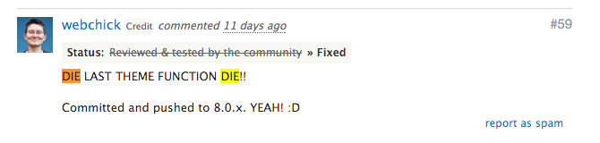

## From Drupal 7 to Drupal 8

### Converting `theme()` functions to Twig templates

- [Convert core theme functions to Twig templates](https://www.drupal.org/node/1757550)

All of the `theme()` functions are deprecated in Drupal 8. They are all converted into twig template files.

> **ALL GONE:** All of the `theme()` functions have been converted to Twig templates.

### Removing the template process layer

- [Remove the process layer (hook_process and hook_process_HOOK)](https://www.drupal.org/node/1843650)
- [The template process layer has been removed](https://www.drupal.org/node/2038981)

The process layer was created to flatten complicated data structures - such as objects or arrays - into strings. In practice, render arrays themselves allow for late rendering via theme function or template file (and can be manipulated in other preprocess functions), and objects can implement `__toString` methods for printing. There is no longer a need for this whole extra layer of processing before rendering.

Since the process layer got removed, the only layer between the data and the template is the *preprocess* layer.

### The preprocess layer

The preprocess layer still exists, but it's used for a different purpose. In Drupal 8, the preprocess layer should not be used to add css classes. This should be done in the template files.

- [CSS classes being moved from preprocess to Twig templates](https://www.drupal.org/node/2325067).
