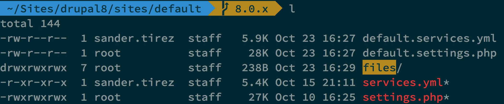

## Find and override a template

### Enable Twig Debug

- Navigate to `sites/default` and copy the `default.services.yml` file to `services.yml`.

- Open this new `services.yml`:

  

- Search for `twig.config`. Below, search for `debug: false`.

- Change this to `debug: true`

- Open the console of your Browser.

### Theme debug suggestions

The files with **(\*)** are theme hook suggestions, and can be used to override the template file in more specific and less generic use cases. The file marked with **(x)** is template file that is currently being used to print the markup.

    <!-- FILE NAME SUGGESTIONS:
       * html--front.html.twig
       * html--.html.twig
       x html.html.twig
    -->
    <!-- BEGIN OUTPUT from 'core/modules/system/templates/html.html.twig' -->
