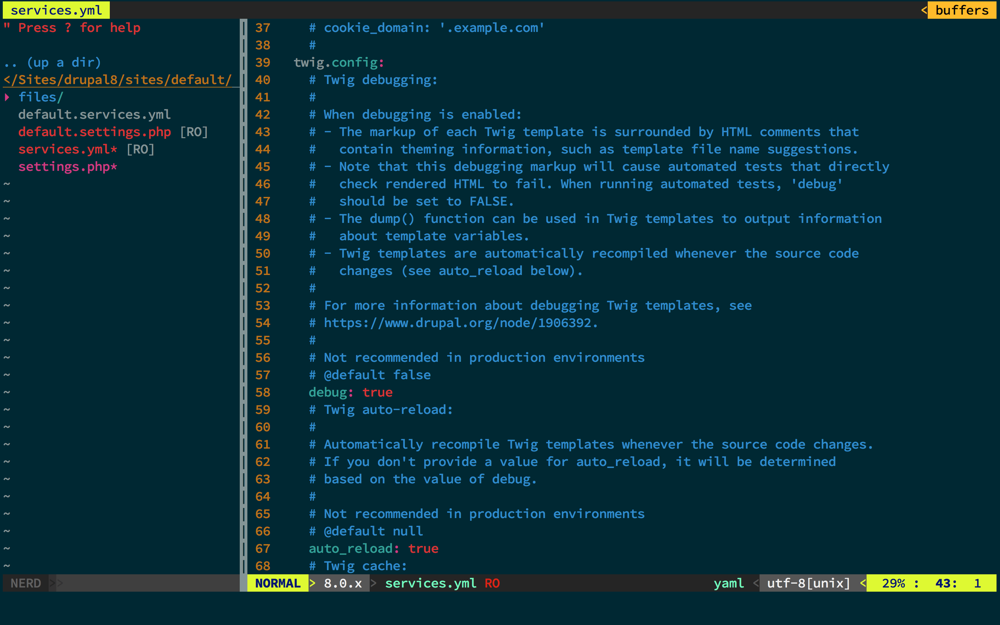
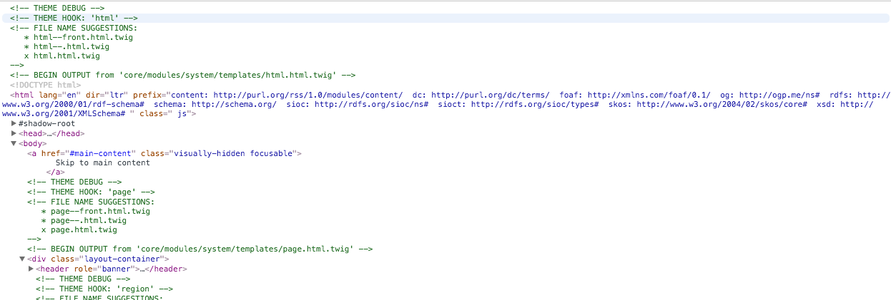

## Twig debug

A new feature in Drupal core is the theùe debug tool. It allows developers to trace from which template files certain markup comes. To enable Twig Debugging, all you have to do is set the `debug` variable in the `twig.config ` to `true`.

**sites/default/services.yml**:

    parameters:
      twig.config:
        debug: true # originally false

When opening the web console, HTML comments are added:

    <!-- FILE NAME SUGGESTIONS:
       * html--front.html.twig
       * html--.html.twig
       x html.html.twig
    -->
    <!-- BEGIN OUTPUT from 'core/modules/system/templates/html.html.twig' -->

> A system like this has been backported to **Drupal 7**. It can be activated by adding `$conf['theme_debug'] = TRUE;` inside `settings.php`

### Theme debug suggestions

The files with **(\*)** are theme hook suggestions, and can be used to override the template file in more specific and less generic use cases. The file marked with **(x)** is template file that is currently being used to print the markup.

    <!-- FILE NAME SUGGESTIONS:
       * html--front.html.twig
       * html--.html.twig
       x html.html.twig
    -->
    <!-- BEGIN OUTPUT from 'core/modules/system/templates/html.html.twig' -->

### Finding a variable.

To print all the available variables (in a template file) the `dump()`-function can be used. To print the content of a specific variable you have to pass the name of the variable as a parameter to the function.

Print *all* available variables:

    {{ dump() }}

Print content of `$foo` variable:

    {{ dump(foo) }}

@todo: Add screenshot

### Finding the active template

### Override templates

### Debugging
